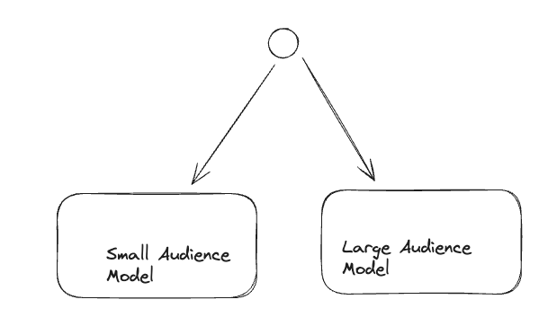

# Executive Summary

The following document highlight the final model which was use for the PoC as well as the features creation, baseline and measurements.

# Definitions:
- CTR: We defined CTR as the `# of approved_clicks / # of approved_opens` for each tuple `(publication_id, campaign_id)`
- publisher is a the entity associated with a `publication_id`
- audience is defined as the average `approved_opens` in a rolling window.

## Architecture:

Since there was distribution shift between CTR values for publications with low number of opens vs larger audiences I've split the
problem in 2. We train a model for those publishers which have audiences greater than 1k and another for the smaller audiences.

Both models are gradient boosted trees `xgboost` models.

### Hyperparameters

| Parameter | Value |
|-----------|-------|
| `max_depth` | 6 |
| `learning_rate` | 0.1 |
| `n_estimators` | 200 |
| `subsample` | 0.8 |
| `colsample_bytree` | 0.8 |
| `min_child_weight` | 5 |
| `reg_alpha` | 0.1 |
| `reg_lambda` | 1.0 |
| `objective` | `reg:squarederror` `reg:absoluteerror` | 

---

## Features

After making a correlation analysis as well as variance analysis it was confirmed (to nobody's surprise) that there was a strong dependence between the CTR and prior interactions between publisher and campaign. So the final feature architecture is based on the encoding of **publisher-specific features**, **campaign-specific features**, and **temporal features**.

### Publisher Features

These features are keyed by `publication_id` and computed using a **90-day rolling window**.

| Feature | Type | Description |
|---------|------|-------------|
| `pub_avg_opens` | Numerical | Average number of approved opens per placement |
| `pub_std_opens` | Numerical | Standard deviation of approved opens |
| `pub_ctr_mean` | Numerical | Historical mean CTR for this publisher |
| `pub_placement_count` | Numerical | Number of placements in the rolling window |
| `tfidf_*` | Numerical | TF-IDF scores derived from publication tags (50 features) |

#### TF-IDF Topic Features

The following topics are extracted from publication tags: `ai`, `arts`, `automotive`, `b2b`, `books`, `business`, `careers`, `computing`, `crypto`, `design`, `drink`, `ecommerce`, `education`, `engineering`, `entertainment`, `estate`, `family`, `fashion`, `finance`, `fitness`, `food`, `garden`, `government`, `health`, `hobbies`, `home`, `hr`, `interests`, `law`, `machines`, `marketing`, `news`, `parenting`, `personal`, `pets`, `politics`, `real`, `religion`, `sales`, `science`, `shopping`, `society`, `spirituality`, `sports`, `startups`, `style`, `technology`, `travel`, `writing`.

### Campaign Features

These features are keyed by `campaign_id` and include both historical statistics and campaign attributes.

| Feature | Type | Description |
|---------|------|-------------|
| `campaign_ctr_mean` | Numerical | Historical mean CTR for this campaign |
| `campaign_ctr_std` | Numerical | Standard deviation of CTR |
| `campaign_ctr_count` | Numerical | Number of placements for this campaign |
| `campaign_weighted_ctr` | Numerical | CTR weighted by total clicks/opens |
| `num_income_targets` | Numerical | Count of targeted income ranges |
| `num_age_targets` | Numerical | Count of targeted age ranges |

#### Campaign Categorical Features (One-Hot Encoded)

| Feature Group | Values |
|---------------|--------|
| **Target Gender** | `gender_no_pref`, `gender_balanced`, `gender_male`, `gender_female`, `gender_unknown` |
| **Promoted Item** | `item_product`, `item_service`, `item_newsletter`, `item_knowledge`, `item_event`, `item_other`, `item_unknown` |
| **Income Ranges** | `income_range_1`, `income_range_2`, `income_range_3`, `income_range_4`, `income_range_5` |

### Temporal Features

Derived from the `post_send_at` timestamp of each placement.

| Feature | Type | Description |
|---------|------|-------------|
| `month` | Numerical | Month of the year (1-12) |
| `hour_morning` | Binary | Send time between 6:00-11:59 |
| `hour_midday` | Binary | Send time between 12:00-17:59 |
| `hour_night` | Binary | Send time between 18:00-5:59 |
| `dow_mon` - `dow_sun` | Binary | Day of week indicators |

### Data Imputation

This feature split helps with data imputation in case of out-of-distribution inference. When a prediction is requested for a **new publisher** or **campaign**, we use the `mode` of each categorical feature and the `mean` of the numerical ones, computed from the training data.

---

## Base Model

For my comparisons I decided to use the average global historical CTR and the average CTR for each range of `approved_opens`. The solution was able to 
improved almost 50% the stablish baseline.

## Evaluation

For evaluation we use both **R²** and **MAE** metrics to have a notion of whether the model actually understood the trend of the dataset and to measure the distance of error.

Metrics were **weighted by the amount of `approved_opens`** since a 10% discrepancy in 100 clicks is not the same as a 10% error in 1K clicks.

---

### Overall Performance

| Metric | Value |
|--------|-------|
| **MAE** | 0.019036 |
| **RMSE** | 0.083099 |
| **R²** | 0.337414 |
| **MAPE** | 85.20% |
| **Median AE** | 0.001875 |

---

### Performance by Audience Segment

| Segment | Samples | MAE | R² |
|---------|---------|-----|-----|
| Small Audience (<1,000 opens) | 28,926 | 0.042817 | 0.286 |
| Large Audience (≥1,000 opens) | 35,555 | 0.001502 | 0.428 |

The large audience model achieves significantly better performance, with **96.5% lower MAE** and **49% higher R²** compared to the small audience model.

---

### MAE by Opens Bins

| Opens Bin | Count | MAE | Mean CTR |
|-----------|-------|-----|----------|
| 0 - 100 | 12,946 | 0.077415 | 9.57% |
| 101 - 500 | 10,377 | 0.020221 | 3.64% |
| 501 - 1,000 | 5,610 | 0.004725 | 0.77% |
| 1,001 - 10,000 | 22,619 | 0.001881 | 0.31% |
| 10,001 - 100,000 | 12,133 | 0.000871 | 0.13% |
| 100,001+ | 796 | 0.000338 | 0.04% |

The model performance improves significantly as audience size increases. For publications with 10K+ opens, MAE drops below 0.1%.

---

### Top 10 Feature Importances

| Rank | Feature | Importance |
|------|---------|------------|
| 1 | `pub_ctr_mean` | 0.0027 |
| 2 | `pub_avg_opens` | 0.0022 |
| 3 | `item_other` | 0.0013 |
| 4 | `tfidf_pets` | 0.0013 |
| 5 | `item_unknown` | 0.0012 |
| 6 | `tfidf_automotive` | 0.0011 |
| 7 | `num_income_targets` | 0.0011 |
| 8 | `tfidf_marketing` | 0.0010 |
| 9 | `gender_unknown` | 0.0009 |
| 10 | `income_range_4` | 0.0009 |

As expected, **publisher historical CTR** (`pub_ctr_mean`) and **audience size** (`pub_avg_opens`) are the most predictive features, confirming the importance of historical interaction data.

